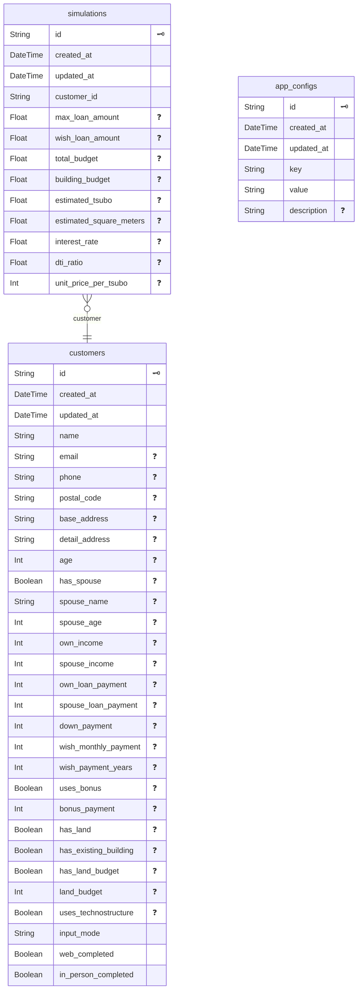

```mermaid
erDiagram

  "customers" {
    String id "🗝️"
    DateTime created_at 
    DateTime updated_at 
    String name 
    String email "❓"
    String phone "❓"
    String postal_code "❓"
    String base_address "❓"
    String detail_address "❓"
    Int age "❓"
    Boolean has_spouse "❓"
    String spouse_name "❓"
    Int spouse_age "❓"
    Int own_income "❓"
    Int spouse_income "❓"
    Int own_loan_payment "❓"
    Int spouse_loan_payment "❓"
    Int down_payment "❓"
    Int wish_monthly_payment "❓"
    Int wish_payment_years "❓"
    Boolean uses_bonus "❓"
    Int bonus_payment "❓"
    Boolean has_land "❓"
    Boolean has_existing_building "❓"
    Boolean has_land_budget "❓"
    Int land_budget "❓"
    Boolean uses_technostructure "❓"
    String input_mode 
    Boolean web_completed 
    Boolean in_person_completed 
    }
  

  "simulations" {
    String id "🗝️"
    DateTime created_at 
    DateTime updated_at 
    String customer_id 
    Float max_loan_amount "❓"
    Float wish_loan_amount "❓"
    Float total_budget "❓"
    Float building_budget "❓"
    Float estimated_tsubo "❓"
    Float estimated_square_meters "❓"
    Float interest_rate "❓"
    Float dti_ratio "❓"
    Int unit_price_per_tsubo "❓"
    }
  

  "app_configs" {
    String id "🗝️"
    DateTime created_at 
    DateTime updated_at 
    String key 
    String value 
    String description "❓"
    }
  
    "simulations" }o--|| customers : "customer"
```
